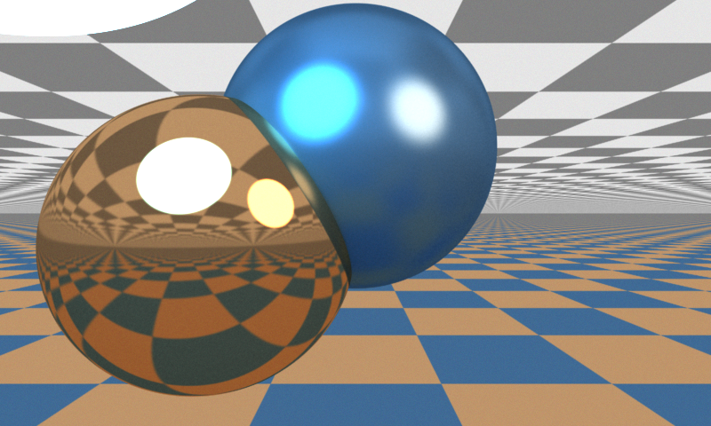

# js-raytrace-demo

### Monte-Carlo raytracing in JavaScript

The demo scene is two interlocking spheres (with varying scattering behaviour), with tiled floor/ceiling, and two luminescent spheres out-of-shot.

* [`index.html`](http://geraintluff.github.io/js-raytrace-demo/index.html) - single image, 400x240
* [`stereographic.html`](http://geraintluff.github.io/js-raytrace-demo/stereographic.html) - two-camera setup, 200x120

The raytracer attempts to estimate the error in the image (based on neighbourhood noise), and selectively renders certain pixels to attempt to get an even level of noise.

The preview/display *adds* noise to the image to simulate an even level of noise.  The idea is to prevent the viewer from attributing noise to object texture.  [Here](http://geraintluff.github.io/js-raytrace-demo/index-no-noise.html) is what it looks like *without* that noise.

Here's a 800x480 version I left running overnight:

